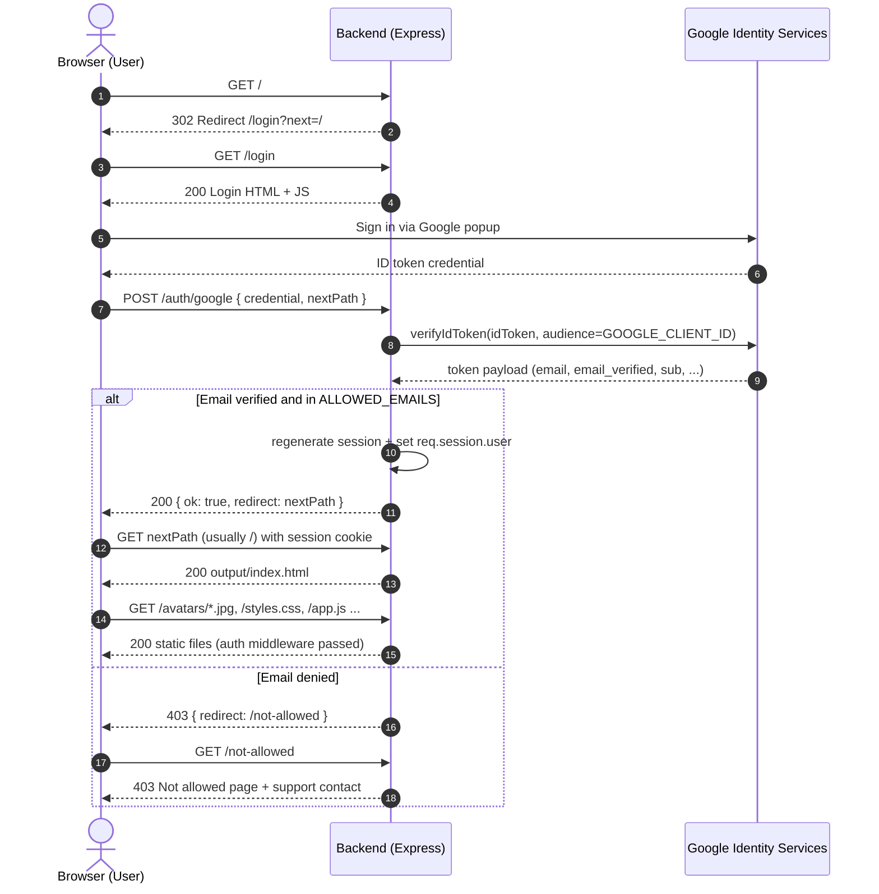

# Authentication Flow (Sequence Diagram)

This document shows how secure mode gates the generated static site behind Google sign-in and allowlisted emails.

## Main sequence

## Why anonymous users cannot access static files

1. `GET /` is protected by `requireAuth` and redirects to `/login` when there is no session.
2. After that, the app applies `app.use(requireAuth, ...)` globally before `express.static(outputDir)`.
3. Because static serving is mounted after auth middleware, direct requests to built assets (including avatars) are also blocked until the session exists.
4. Session cookie is `HttpOnly`, `SameSite=Lax`, and `Secure` in production, with TTL from `SESSION_TTL_HOURS`.

## Public vs protected routes

- Public:
  - `/login`
  - `POST /auth/google`
  - `/not-allowed`
  - `/health`
  - `/auth-assets/*` (CSS/JS for login/not-allowed pages)
- Protected:
  - `/`
  - `/api/session`
  - all generated static files from `SITE_OUTPUT_DIR` (for example `/avatars/*`, CSS, JS, HTML pages)

## Important deployment note

This protection works only when traffic goes through the secure Node server.

If the `output/` folder is also published as a public static host (for example pure GitHub Pages), that public endpoint bypasses authentication.
